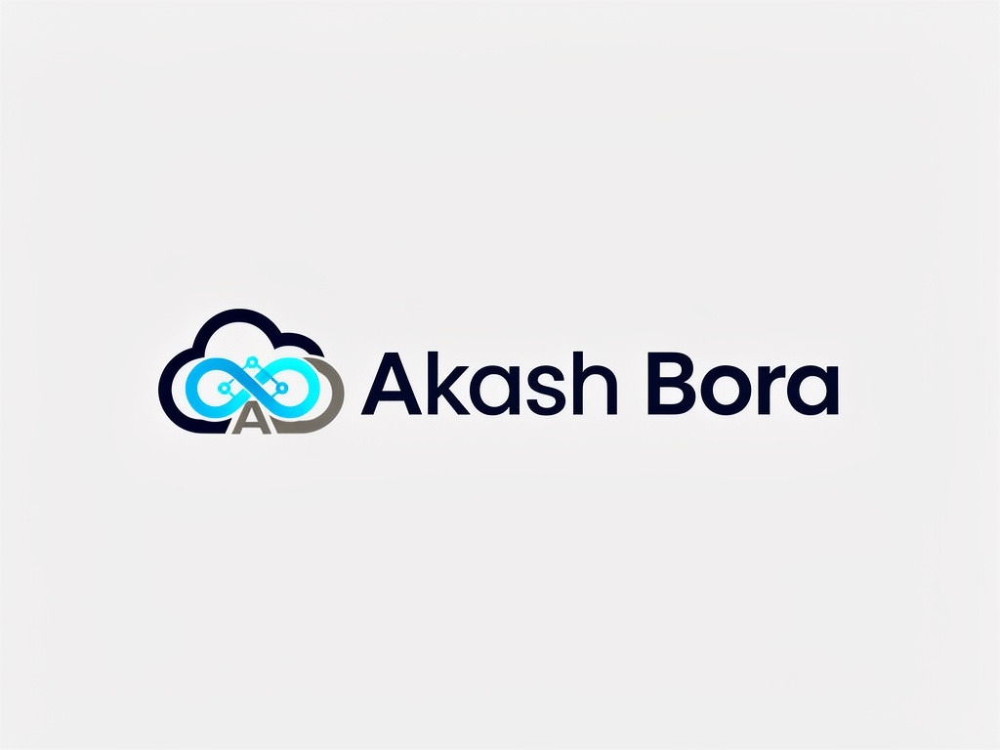

# Akash Bora — Cloud & DevOps Engineer Portfolio

A responsive, high-performance portfolio website built with HTML5, CSS3, Bootstrap 5.3, and modern JavaScript, designed specifically to showcase Cloud, Kubernetes, CI/CD, and GitOps engineering projects.

## 🚀 Live Demo & Features
- **Interactive Cloud Shell / Terminal**: Simulates real `kubectl`, `terraform`, and `gitops sync` CLI commands.
- **Interactive CI/CD & GitOps Pipeline Visualizer**: Explores code commit to production EKS rollout step-by-step.
- **Verified Credentials**:
  - **AWS Certified Solutions Architect – Professional** (Amazon Web Services)
  - **DevOps & Cloud Engineering Certification** (TrainWithShubham)
- **Work History & Key Projects**:
  - **Groots** (Cloud Engineer | Latest / Present)
  - **Hisan Labs Pvt. Ltd.** (DevOps Engineer)
  - **Tradetron** (Linux Engineer / DevOps & Automation)
- **Interactive Contact Form**: Client-side validation with real-time feedback and direct WhatsApp / Email buttons.

## 🛠️ Tech Stack
- **Frontend**: HTML5, CSS3 (Custom Glassmorphism + Neon Theme), Bootstrap 5.3, Devicons, FontAwesome 6
- **Interactivity**: Vanilla JS, Canvas Particle Network, Dynamic Typing, Scroll-triggered Counters
- **Deployment**: Docker, Nginx, GitHub Pages, Vercel, Netlify, AWS (S3 + CloudFront)

## 📖 Deployment & Run Manual
See [PRM.md](PRM.md) for full deployment instructions.

## 📬 Contact
- **Email**: akashbora0082@gmail.com
- **Phone**: +91-7057100082
- **LinkedIn**: [linkedin.com/in/akash-bora/](https://www.linkedin.com/in/akash-bora/)
- **GitHub**: [github.com/Akashbora02](https://github.com/Akashbora02)
