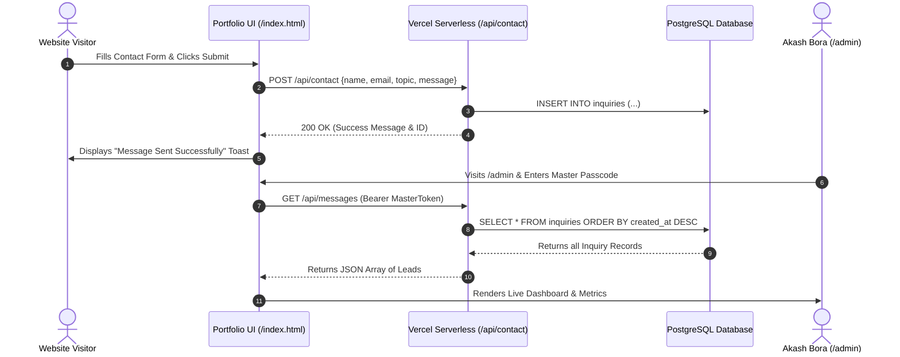

# Vercel Deployment & PostgreSQL Database Guide
## Akash Bora — DevOps & Cloud Engineer Portfolio

This guide explains how to deploy your portfolio to **Vercel**, configure **Clean `/admin` URLs**, and connect a **PostgreSQL Database** for permanent inquiry storage.

---

## 1. Quick Deployment to Vercel

Your portfolio is pre-configured with `vercel.json` for:
- Automatic clean URLs (`/admin` &rarr; `admin/index.html`).
- Serverless API routes (`/api/contact`, `/api/messages`).
- Enterprise security headers (CSP, HSTS, XSS protection, Cache-Control).

```bash
# Push directly to your verified GitHub repository
git add .
git commit -m "feat: updated logo, postgresql integration, and mobile responsive refinements"
git push origin main
```

---

## 2. Setting Up Free PostgreSQL on Vercel (or Neon / Supabase)

### Option A: Vercel Postgres (Neon) - 100% Free
1. Go to your [Vercel Dashboard](https://vercel.com/dashboard).
2. Navigate to **Storage** &rarr; **Create Database** &rarr; **Postgres**.
3. Choose a name (e.g. `akash-portfolio-db`) and select region (e.g. `ap-south-1` Mumbai / `sin1` Singapore).
4. Click **Connect to Project** and select `akash-bora-portfolio-new`.
5. Vercel will automatically inject `POSTGRES_URL` into your project environment variables.
6. The `inquiries` table is **automatically created on first submission** via `api/contact.js`!

### Option B: Supabase / Neon External PostgreSQL
1. Create a free database on [Neon.tech](https://neon.tech) or [Supabase.com](https://supabase.com).
2. Run `schema.sql` in the SQL Editor:
```sql
CREATE TABLE IF NOT EXISTS inquiries (
  id VARCHAR(64) PRIMARY KEY,
  name VARCHAR(255) NOT NULL,
  email VARCHAR(255) NOT NULL,
  subject VARCHAR(255),
  topic VARCHAR(255),
  message TEXT NOT NULL,
  status VARCHAR(32) DEFAULT 'unread',
  created_at TIMESTAMP WITH TIME ZONE DEFAULT CURRENT_TIMESTAMP
);
```
3. In Vercel Project Settings &rarr; **Environment Variables**, add:
   - **`POSTGRES_URL`**: `postgres://postgres:[PASSWORD]@[HOST]:5432/[DATABASE]?sslmode=require`
   - **`NOTIFICATION_EMAIL`**: `akashbora0082@gmail.com`
   - **`RESEND_API_KEY`**: *(Optional for instant email alerts on new inquiries)*

---

## 3. How the Data Flow Works



---

## 4. Admin Portal Access & Controls

- **URL**: `https://your-portfolio.vercel.app/admin`
- **Stealth Shortcut**: Press **`Ctrl + Shift + A`** (or `Cmd + Shift + A`) from any page.
- **Passcode**: Master Passcode protected with salted SHA-256 Web Crypto hashing.
- **Live Sync**: When you unlock the dashboard, it fetches live leads directly from PostgreSQL and allows you to mark messages read/replied, reply via email, export CSV, and delete messages.
